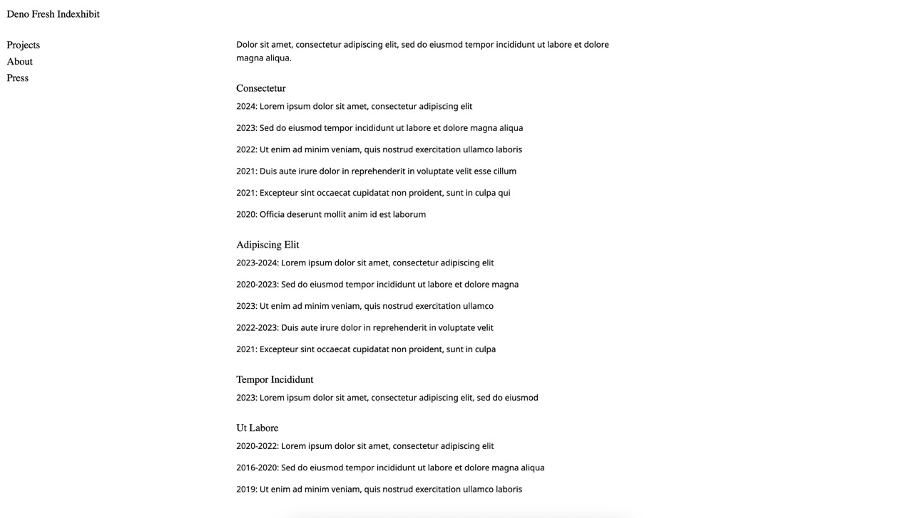
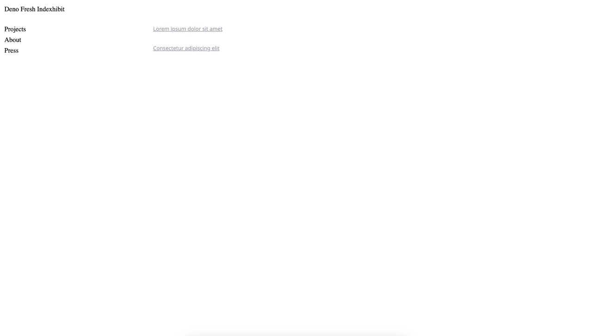
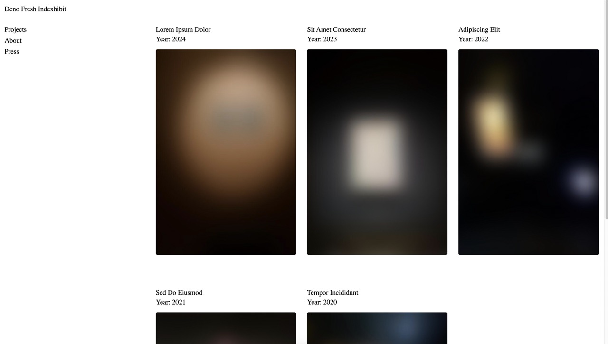

<div style="display: flex; align-items: center; gap: 10px;">
  <a href="https://deno.com">
    
  </a>
  <a href="https://fresh.deno.dev">
    
  </a>
  <a href="https://pagescms.org">
    
  </a>
</div>


# A Deno Fresh minimal portfolio boilerplate integrated with PagesCMS for easy content management
This is a boilerplate for a portfolio site, built with Deno and Fresh inspired by the minimal aestherics of the indexhibit theme, implemented currently with a 'flat file'-like structure set up with frontmatter to be used with [PagesCMS](https://pagescms.org/).

## How to?

### To run it locally

```
deno task start
```

### To use it with PagesCMS

Simply clone the repo and open the project through PagesCMS' cloud-based CMS.

## Screenshots

### Desktop

<div style="display: grid; grid-template-columns: repeat(3, 1fr); gap: 10px;">
  
  
  
  
  
</div>

### Mobile

<div style="display: grid; grid-template-columns: repeat(2, 1fr); gap: 10px;">
  
  
</div>

## ...


